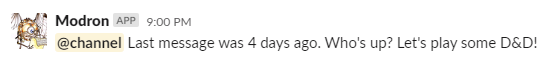
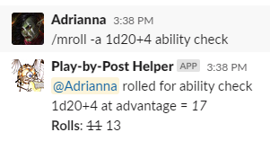
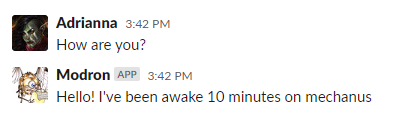

# Play-by-Post Helper

[](https://travis-ci.org/WardLT/play-by-post-helper)

The Play-by-Post Helper (Modron) is a Slack bot that assists playing Role Playing Games (RPGs) with Slack.

The helper is designed to be a simple Slack Bot for performing tasks including:

- Messaging the channel to remind people if play has stalled
- Performing rolls according to D&D 5e rules

## Using Modron

### Channel Reminders

 

Modron will automatically watch the the channels to issue reminders as needed.
Configure the channels that Modron watches for activity and which channel
it writes reminders to in `server.py`

### Rolling Dice



Modron supports all of the D&D 5e rules for dice rolling, such
as advantage and re-rolling ones.
Roll dice by calling `/modron roll`.
A few examples include:

   - `/modron roll 1d20+5`: Rolling a single D20
   - `/modron roll 4d6 -1`: Roll 4d6 and re-roll any dice that are 1 on the first roll
   
`/mroll` is a shortcut for `/modron roll` you can use to type less. 

### Status Checks



Send direct messages to Modron and it will reply with status information.  

## Installation

The package has limited requirements on the Python end. 
Install the environment using conda with the command:

```bash
conda env create --file environment.yml --force
```

The more complicated step is to create the Slack App itself.
The [tutorial on the GitHub page for the Python API](https://github.com/slackapi/python-slackclient/tree/master/tutorial)
is very good!
Follow the directions from the first section to create the app,
 give it the required permissions,
 and access the AccessToken.

The app requires at least the following Bot Token Scopes (refer back to the [tutorial](https://github.com/slackapi/python-slackclient/blob/master/tutorial/01-creating-the-slack-app.md#give-your-app-permissions)):
- `app_mentions:read`: Asking the bot to keep track of things
- `channels:history`: Allowing the bot to read the channel history
- `channels:join`: Allow bot to add itself to channels
- `channels:read`: Allows bot to figure out which channels it need add itself to
- `chat:write`: Send chat messages as its own personality
- `im:write`: Send messages to people on private channels
- `mpim:write`: Send messages to groups of people

_Note_: Some of the features alluded to by these permissions have not been implemented yet.
 
You will need to store the access token as an environment variable named ``OAUTH_ACCESS_TOKEN``
for the bot to use it. 
My preferred method is to store it as an environment variable. 

### Running the App

Launch the Bot by first activating the appropriate Conda environment, 
and then running:

```bash
export FLASK_APP=server.py
flask run --host 0.0.0.0 --port <your choice>
```

The app will run as a long-lived process (spending most of its time in a sleep state)
 and prints log messages to the screen.

The application itself is designed to be very lightweight. 
I run the application on a Raspberry Pi, but you could also easily run it on 
small instances on cloud compute providers if you do not have a home server. 

### Registering a Web Service

The interactive elements of Modron requires a webserver that can respond to incoming requests.

The Slack API recommends you use [`ngrok`](https://ngrok.com/) to start with, 
which I would also recommend highly.
It not only forwards requests over a tunnel but also handles HTTPS authentication.
You need not even set up Flask to use HTTPS (which is a bit involved but
 [well described in a blog](https://blog.miguelgrinberg.com/post/running-your-flask-application-over-https))

I eventually settled on using DuckDNS to give a public address for Modron, 
which took a little work to make happen because I have to use my own HTTPS authentication.
See the [Let's Encrypt forum](https://community.letsencrypt.org/t/raspberry-pi-with-duckdns-ddns-failing-to-verify/53567/9)
for details on how to get the certificates set up behind DuckDNS.
You then will need to modify the above run command for the service to point to your certificates, 
and would recommend you read [Miguel Grinberg's blog](https://blog.miguelgrinberg.com/post/running-your-flask-application-over-https)
to understand how that could work.

Once you have the server ready to receive incoming requests, register the URL with Slack.
See Slack's documentation on 
[creating Slash commands](https://api.slack.com/interactivity/slash-commands#creating_commands)
and [subscribing to events](https://api.slack.com/events-api#subscriptions) for how to register URLs.
You will need the following Slash commands: `/modron`, `/mroll`, `/mnpcgen`.
All of the Slash commands are routed to the same HTTP endpoint: `https://<your url>/modron`
