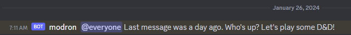

# Play-by-Post Helper

The Play-by-Post Helper (Modron) is a Discord bot that assists playing Role Playing Games (RPGs) on Discord.
Modron can do common tasks for D&D and other TTRPG games, including:

- Messaging the channel to remind people if play has stalled
- Performing rolls according to D&D 5e rules
- Keeping track of character ability and health

## Setting Up Modron

Modron is a Python-based web server that you will need to install and then register with Discord.
The [installation guide](./docs/installation.md) describes how to install it for your Guild.

## Using Modron

Modron is a collection of Discord slash commands and persistent services. 
We briefly introduce them here and refer you to the [user guide](./docs/user-guide.md)
for the full documentation. 

### Rolling Dice

Modron supports the D&D 5e rules for dice rolling, such as advantage and re-rolling ones.
A few examples include:

   - `$roll 1d20+5`: Rolling a single D20
   - `$roll 4d6 -1`: Roll 4d6 and re-roll any dice that are 1 on the first roll

### Tracking HP and Character Sheets

Modron can look up values from a character sheet for each player and change its HP over time.

### Channel Reminders

 

Modron will issue reminders if play stalls for more than a configurable amount.
