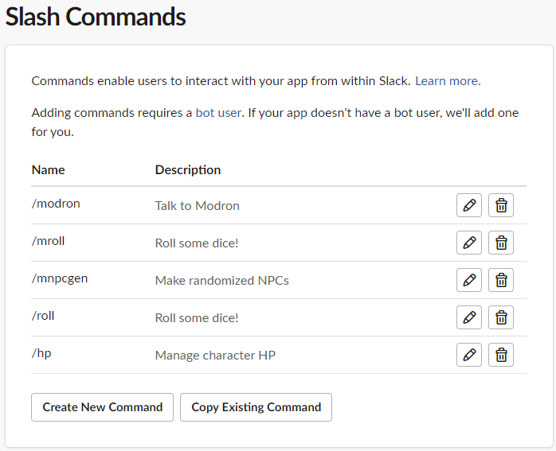
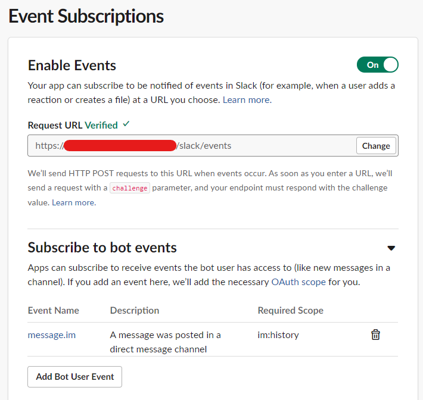

# Installation

Installing Modron requires:

1. [Installing the Computational Environment](#installing-python-requirements)
1. [Creating Authorization Credentials](#creating-the-slack-app)
1. [Registering Server with Slack](#registering-with-slack)
1. [Adding Character Sheets](#adding-character-sheets)

## Where to Install and Run Modron

Modron is designed to run as a persistent service and will need to be running
whenever you are using Slack to play an RPG. 
The resource requirements for Modron are minimal and can easily run on 
a second generation Raspberry Pi (512 MB RAM, 700 MHz ARM processor) 
or an Amazon `t2.nano`.

## Installing Python Requirements

Modron has limited Python requirements, which we describe with Anaconda.
Install the environment using conda with the command:

```bash
conda env create --file environment.yml --force
```

The NPC generator requires the [`wkhtmltopdf` command line tool](https://wkhtmltopdf.org/index.html) to be installed.

## Creating the Slack App

The more complicated step is to create the Slack App itself.
The [tutorial on the GitHub page for the Python API](https://github.com/slackapi/python-slackclient/tree/master/tutorial)
is very good!
Follow the directions from the first section to create the app,
 give it the required permissions,
 and access the AccessToken.

The app requires at least the following Bot Token Scopes (refer back to the [tutorial](https://github.com/slackapi/python-slackclient/blob/master/tutorial/01-creating-the-slack-app.md#give-your-app-permissions)):
- `app_mentions:read`: Asking the bot to keep track of things
- `channels:history`: Allowing the bot to read the channel history
- `channels:join`: Allow bot to add itself to channels
- `channels:read`: Allows bot to figure out which channels it need add itself to
- `chat:write`: Send chat messages as its own personality
- `files:write`: Send users PDF summaries of NPC generation
- `commands`: Support for the slash commands
- `im:history`: (Not sure why this is required)
- `im:write`: Send messages to people on private channels
- `im:read`: Send messages to people on private channels
- `mpim:write`: Send messages to groups of people
- `users:read`: Get information about users

## Launching Modron for First Time

The setup process will create authentication credentials needed for the app to run.
Record them in the environment variables in [start-service.sh](../start-service.sh):

- `SLACK_SIGNING_SECRET`: Signing secret for messages from Slack
- `OAUTH_ACCESS_TOKENS`: Access tokens for each Slack team that uses Modron
- `CLIENT_SECRET`: Client secret
- `CLIENT_ID`: Client ID for the Modron app
 
Hint: See [step 4 of the tutorial](https://github.com/slackapi/python-slackclient/blob/master/tutorial/04-running-the-app.md)
for how to access these tokens.

Next, edit the [modron_config.yml](../modron_config.yml) file to contain
the team ID and name for your Slack workspace. The team name 
is in the URL of your Slack (e.g., `https://app.slack.com/client/<team id>`).
A minimal example for the configuration is as follows:

```yaml
team_options:
  <team id>:
    name: <team name>
```

Once the configuration is set, run Modron with the default settings by 
first activating the Anaconda environment and then calling: `./start-services.sh`

## Registering with Slack

At this point, Modron is able to communicate *to* Slack but will require more
configuration to receive communications *from* Slack.
In particular, the slash commands require Slack to be able to send requests to Modron.
The key challenge here is creating an public URL for your application.

### Creating a Public URL

The Slack API recommends you use [`ngrok`](https://ngrok.com/) to create a public endpoint, 
which I would also recommend highly.
It creates a public URL for your web services and alleviates the need to create an HTTPS certificate
or open ports on your web server/router.
The downside is that you need to run a second service.

I eventually settled on using DuckDNS to give a public address for Modron and handled HTTPS certificates myself.
See the [Let's Encrypt forum](https://community.letsencrypt.org/t/raspberry-pi-with-duckdns-ddns-failing-to-verify/53567/9)
for details on how to get the certificates set up behind DuckDNS.
You then will need to modify `start-services.sh` to point to your certificates, 
and would recommend you read [Miguel Grinberg's blog](https://blog.miguelgrinberg.com/post/running-your-flask-application-over-https)
to understand how that works.

### Configuring Slack

Next, register the URL you created with Slack.
See Slack's documentation on 
[creating Slash commands](https://api.slack.com/interactivity/slash-commands#creating_commands)
and [subscribing to events](https://api.slack.com/events-api#subscriptions) for how to register URLs.



You will need the following Slash commands: `/modron`, `/mroll`, `/mnpcgen`, `/roll`,
and `/hp`.
All of the Slash commands are routed to the same HTTP endpoint: `https://<your url>/modron`

Register for events from Slack by adding your URL to the Event Subscription page
and subscribing to the `message.im` event.



## Customizing Modron

The [`modron_config.yml`](../modron_config.yml) contols many of the key features of Modron.
See the complete list of options in [`modron/config.py`](../modron/config.py).
Note that you must reboot Modron each time you change the YAML file in order
for the changes to take effect.
We describe a few of the features which require some extra to get working.

### Reminders

Modron was written assuming that the channels follow the a naming convention
where channels involving in-character dialogue have names beginning with `ic_`.
By default, Modron will watch every channel whose name begins with `ic_`
and send reminders to the main channel, `ic_all`, if nothing has been posted in a day.
You may want to name your channels to follow this naming convention
or redefine the `reminder_channel` on which to issue reminder messages or
the `watch_channels` regex to control which channels to watch for activity.

### Backing up to Google Drive

Modron automatically downloads channel activity and, if proper credentials are acquired,
upload them to Google Drive. 
The code is written to assume the same naming credentials (e.g., in-character channels
begin with `ic_`) as the reminder service and will automatically download messages
from each of those channels.
Adjust `backup_channels` to control which channels are downloaded.

If you would like backup to Google drive, create a Google API project 
and activate the Google Drive API for that project following [Google's documentation](https://developers.google.com/drive/api/v3/enable-drive-api).
Once complete, download the credentials to `creds/grive` and run `get-gdrive-creds` to
get credentials for your user account. 
The `token.pickle` file produced by your application contains the credentials needed by
Modron to access Google Drive on your behalf. 
Then, change the `backup_folder` configuration to point to a folder in your Google Drive.
Folder IDs are available from the URL: `https://drive.google.com/drive/u/0/folders/<folder id>`

### Adding Character Sheets

Character sheets for Modron are stored in a YAML format on your server. 
See [`Adrianna`](../characters/kaluth/adrianna.yml) as an example.
Add your own characters by first creating a subdirectory in `characters` named
after your campaign and then add characters following the schema described 
in [`characters.py`](../modron/characters.py).
