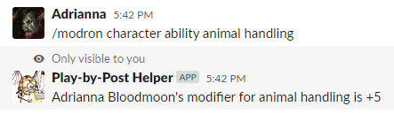
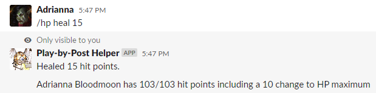
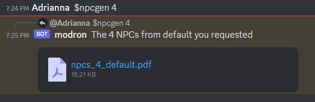

# User Guide

> **Note**: This documentation is from the Slack version of Modron and is out of date 

There are several routes for players to interact with Modron:

1. [Slash Commands](#slash-commands)
2. [Direct Messages](#direct-messages)

There are also passive services that users may interact with:

1. [Persistent services](#persistent-services)

## Slash Commands

The primary way players will interact with Modron is via slash commands.
Modron will reply to specially-constructed commands in the Slack chat that all
begin with a / character.
The commands can all be accessed through messages `/modron` though,
as we note below, many common commands have shortcuts.

Modron's slash commands are modeled after Linux command line programs
and, similarly, adding `-h` or `--help` to the end of a command 
will generate a help file.

If you make mistakes, Modron should reply back with an error message
describing what was wrong about your command. 

### Rolling Dice

Modron supports all of the D&D 5e rules for dice rolling, such
as advantage and re-rolling ones.
Roll dice by calling `/modron roll`, `/mroll`, or just `/roll`.
A few examples include:

   - `/modron roll 1d20+5`: Rolling a single D20
   - `/modron roll 4d6 -1`: Roll 4d6 and re-roll any dice that are 1 on the first roll

The `/roll` command can lookup dice modifiers off of character sheets
[if installed](installation.md#adding-character-sheets):

   - `/roll -a stealth`: Roll a Stealth Check at advantage
   
### Managing Characters

All interactions with a character sheet is handled through `/modron character`

Before running any of these commands, ensure you have a character installed with Modron
by calling `/modron character`. Modron should reply with your character name and level.

#### Looking up Ability Scores

The `/modron character ability` command allows you to lookup values of a character.

#### Managing Health Points

`/modron character hp` (shortcut: `/hp`) lets you keep track of a character's HP. 
It links to several subcommands:

   - `/hp`: Just print out the character's health
   - `/hp heal <amount>`: Heal a character by a certain amount 
   - `/hp heal full`: Heal a character back to their hit point maximum 
   - `/hp harm <amount>`: Apply a certain amount of damage to a character
   - `/hp temp <amount>`: Grant a certain number of temporary hit points
   - `/hp temp reset`: Remove any temporary hit points 
   - `/hp max <change>`: Alter the character's HP maximum by a certain amount
   - `/hp max reset`: Reset any changes to the HP maximum
   
### Generating NPCs

Modron will generate randomized NPCs on demand. 
The random character generator can be configured based on your campaign setting
and returns the NPC physical description and a little bit about their life
to help the DM make a world that feels real.
NPCs are returned as a PDF so you can add notes to the generated table later.

### Checking on Reminders

The `/modron reminder` lets you check the status of the reminder thread and
delay reminders if everyone is busy.

## Direct Messages

Modron will respond if you IM it directly.

### Status Checks

Send direct messages to Modron and it will reply with status information.  

## Persistent Services

## Channel Reminders

 

Modron will automatically watch the Slack and issue reminders if play stalls.

### Message Back-up

Modron will automatically download recent messages to disk and, 
[if configured](installation.md#backing-up-to-google-drive), upload them to Google drive for later use.
