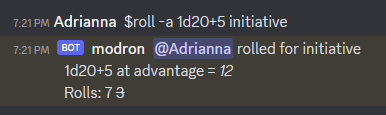

# User Guide

**TBD**: This guide is a work in procress

## Slash Commands

### Rolling Dice

Modron supports all of the D&D 5e rules for dice rolling, such
as advantage and re-rolling ones.
Roll dice by calling `/modron roll`, `/mroll`, or just `/roll`.
A few examples include:

   - `/modron roll 1d20+5`: Rolling a single D20
   - `/modron roll 4d6 -1`: Roll 4d6 and re-roll any dice that are 1 on the first roll

## Persistent Services

## Channel Reminders

 

Modron will automatically watch the Slack and issue reminders if play stalls.

### Back-up

## Other Interactivity
   
### Status Checks

Send direct messages to Modron and it will reply with status information.  
