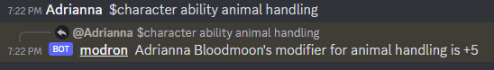
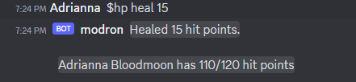

# User Guide

Interact with Modron by messaging Discord with commands that start with `$`, such as `$modron`.
We describe [the main features below](#discord-commands)

Some the commands interact with [persistent services](#persistent-services)

## Discord Commands

The primary way players will interact with Modron is via Discord commands.
Modron will reply to specially-constructed commands in the Discrd chat that all
begin with a `$`.
List the available commands with `$modron` and print their descriptions 
by adding `-h` or `--help` to the end of a command.

### `$roll`: Rolling Dice

Modron supports all D&D 5e rules for dice rolling, such
as advantage and re-rolling ones.
A few examples include:

   - `/modron roll 1d20+5`: Rolling a single D20
   - `/modron roll 4d6 -1`: Roll 4d6 and re-roll any dice that are 1 on the first roll

The `/roll` command can lookup dice modifiers off of character sheets
[if installed](installation.md#adding-character-sheets):

   - `/roll -a stealth`: Roll a Stealth Check at advantage
   
### `$character`: Managing Characters

> Before running any of these commands, ensure you have a character installed with Modron
by calling `/modron character`. Modron should reply with your character name and level.

The character command provides:

- `$character ability` looking up ability scores from the character sheet

The `/modron character ability` command allows you to lookup values of a character.

### `$hp`: Managing Health Points

 
It links to several subcommands:

   - `$hp`: Just print out the character's health
   - `$hp heal <amount>`: Heal a character by a certain amount 
   - `$hp heal full`: Heal a character back to their hit point maximum 
   - `$hp harm <amount>`: Apply a certain amount of damage to a character
   - `$hp temp <amount>`: Grant a certain number of temporary hit points
   - `$hp temp reset`: Remove any temporary hit points 
   - `$hp max <change>`: Alter the character's HP maximum by a certain amount
   - `$hp max reset`: Reset any changes to the HP maximum
   
### `$npcgen`: Generating NPCs

Generate randomized NPCs on demand. 
The random character generator can be configured based on your campaign setting
and returns the NPC physical description along with a little bit of backstory.
NPCs are returned as a PDF so that you can add notes to the generated table later.

### `$reminder` Checking on Reminders

Check the status of the reminder thread and delay reminders if everyone is busy.

## Persistent Services

Several services run on your server.

## Channel Reminders

 

Modron will issue reminders if play stalls.

### Message Back-up

Modron will automatically download recent messages to disk and, 
[if configured](installation.md#backing-up-to-google-drive), upload them to Google drive for later use.
